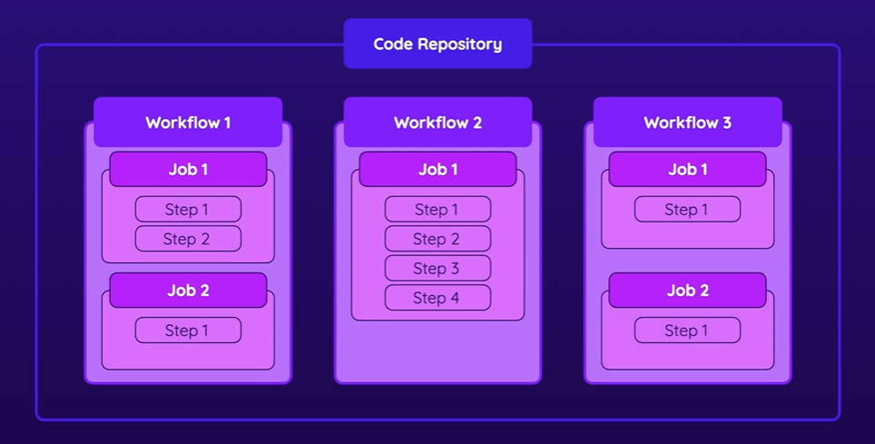

# Key Elements
1. Workflow
- Add workflow to github repostiories, and we can attach as many workflow to github repo
- Workflow includes one or many Jobs
- Trigger upon events to automate workflow
2. Jobs
- Jobs that's contain one or more steps
- Define runner (execution environment)
- Run in parallel (default) or sequential
- Can be condition
3. Steps
- Execute a shell script or an action
- Can use custom or third party acrions
- Steps are executed in order
- Can be conditional  

# GitHub Actions: Availability & Pricing
### In public repositories, you can use GitHub Actions for free. For private repositories, only a certain amount of monthly usage is available for free - extra usage on top must be paid.
### For details pricing: *https://docs.github.com/en/billing/managing-billing-for-github-actions/about-billing-for-github-actions*

