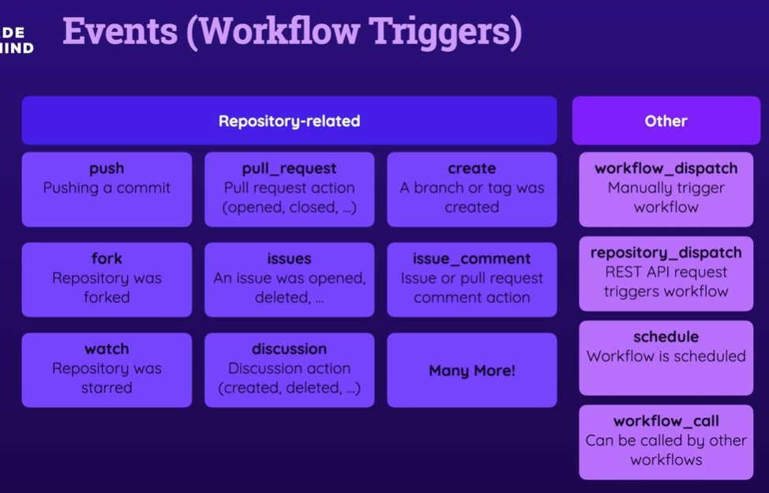
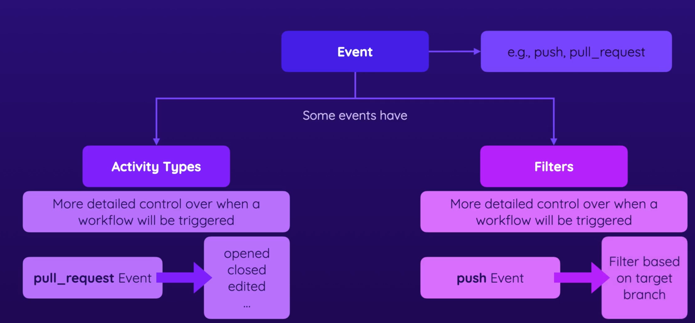

# Events (Workflow trigger)


# Cheat sheet link: 
*https://docs.github.com/en/actions/using-workflows/workflow-syntax-for-github-actions#filter-pattern-cheat-sheet*





### Ref link for github activity types doc *https://docs.github.com/en/actions/using-workflows/events-that-trigger-workflows#pull_request*

## Workflow
```yml
name: Events Demo 1
on:
  pull_request:
    types:
      - opened
    branches:
      - main
      - master
      - 'dev-*' # dev-new dev-this-is-new
      - 'feat/**' # feat/new feat/boat/new
     path:
      - '.github/workflows/*'
      # this events only work for changes done in path mention and not for other path 
  workflow_dispatch:
  push:
    branches:
      - main #main
      - 'dev-*'
      - master
      - 'feat/**'
    path-ignore:
      - '.github/workflows/*'
     # this path ignore means above mention branch will trigeer the events for nay changes except changes done in path-ignore  
jobs:
  deploy:
    runs-on: ubuntu-latest
    steps:
      - name: Output event data
        run: echo "${{ toJSON(github.event) }}"
      - name: Get code
        uses: actions/checkout@v3
      - name: Install dependencies
        run: npm ci
      - name: Test code
        run: npm run test
      - name: Build code
        run: npm run build
      - name: Deploy project
        run: echo "Deploying..."
```

## To skip tigger when you push code, add [skip ci] in commit message
```
git commit -m "Add comment [skip ci]"
```

