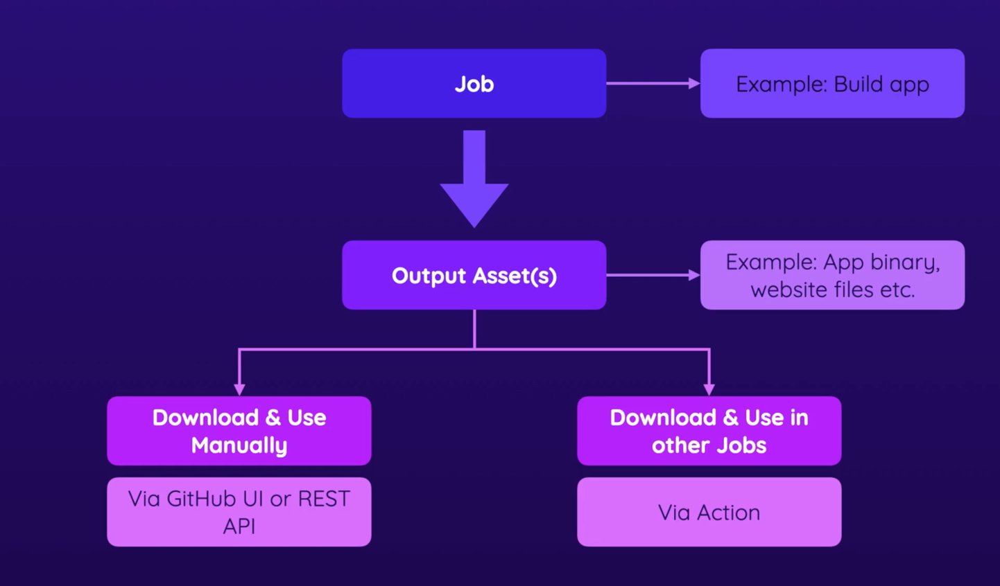

### Workflow 
- 3 jobs inside this workflow, test, build and deploy
```yml
name: Deploy Project
on: 
  push:
    branches:
      - master
      - main
  workflow_dispatch:
jobs:
  test:
    runs-on: ubuntu-latest
    steps:
      - name: Get-code
        uses: actions/checkout@v4
      - name: Install dependencies
        run: npm ci
      - name: Lint Code
        run: npm run lint
      - name: Run test
        run: npm run test
  build:
    needs: test
    runs-on: ubuntu-latest
    steps:
      - name: Get-code
        uses: actions/checkout@v3
      - name: Install dependencies
        run: npm ci
      - name: Build Project
        run: npm run build
      # Need to save artifacts
      - name: Upload Artifacts
        uses: actions/upload-artifact@v4 # *https://github.com/actions/upload-artifact*
        with:
          name: dist-files # name of files to retrieve in other Job
          path: | ## Path where artifact will saved
            dist
  deploy:
    needs: build
    runs-on: ubuntu-latest
    steps:
      - name: Deploy
        run: echo "deploying....."
      - name: Downlaod Artifacts
        uses: actions/download-artifact@v4
        with:
          name: dist-file
      - name: Output Content
        run: ls -l
```

### Download artifact
- manually

- In workflow 
```yaml
# use action
- name: Downlaod Artifacts
  uses: actions/download-artifact@v4
  with:
    # name refer to name from upload artifacts from previous job
    name: dist-file
```