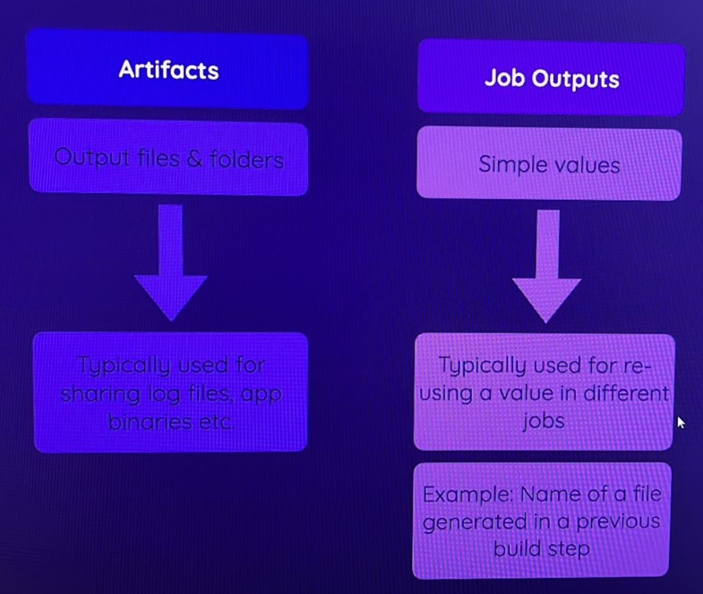

# Jobs Output


### Sometimes we generate output values (not any files) and we want that value to use in another job.

### let understand this by an example.
- our nodejs project generate artifacts, inside artifatcs it creat one file, whose name is random, for any understand this how we save value in one job and passes to other job. we save the name of file in build job and pass it to deploy job.


### Another example
- save value
```yml
outputs:
    name: ${{ steps.unique_step_id.outputs.say }}
steps:
  - name: output value
    id: unique_step_id
    run: echo "say={Raghib}" >> $GITHUB_OUTPUT
```
- use inanother job
```yaml
- name: use output values
  run: ${{ needs.first_job_name.outputs.name }}
```