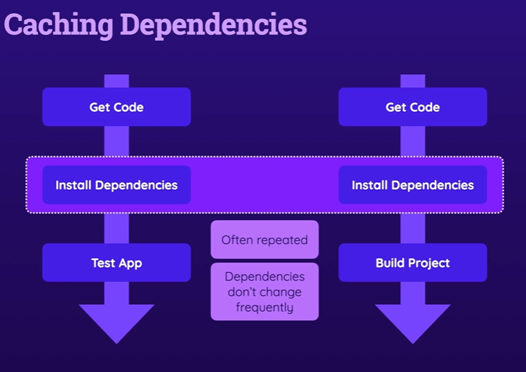

# Caching stage


# Link for caching dependencies doc
*https://docs.github.com/en/actions/using-workflows/caching-dependencies-to-speed-up-workflows*

# workflow
```yml
name: Deploy website
on:
  push:
    branches:
      - main
      - master
jobs:
  test:
    runs-on: ubuntu-latest
    steps:
      - name: Get code
        uses: actions/checkout@v3
      - name: Cache dependencies
        uses: actions/cache@v3
        env:
          cache-name: cache-node-modules
        with:
          path: ~/.npm
          key: ${{ runner.os }}-build-${{ env.cache-name }}-${{ hashFiles('**/package-lock.json') }}
      - name: Install dependencies
        run: npm ci
      - name: Lint code
        run: npm run lint
      - name: Test code
        run: npm run test
  build:
    needs: test
    runs-on: ubuntu-latest
    outputs:
      my-files: ${{ steps.publish_id.outputs.some-files }}
    steps:
      - name: Get code
        uses: actions/checkout@v3
      - name: Cache dependencies
        uses: actions/cache@v3
        env:
          cache-name: cache-node-modules
        with:
          path: ~/.npm
          key: ${{ runner.os }}-build-${{ env.cache-name }}-${{ hashFiles('**/package-lock.json') }}
      - name: Install dependencies
        run: npm ci
      - name: Build website
        run: npm run build
      - name: Publisg JS files
        id: publish_id
        run: find dist/assets/*.js -type f -execdir echo 'some-files={}' >> $GITHUB_OUTPUT ';'
      - name: Upload artifacts
      # https://github.com/actions/upload-artifact
        uses: actions/upload-artifact@v4
        with:
          name: dist-files
          path: dist
          # path: |
            # dist
            # package.json
  deploy:
    needs: build
    runs-on: ubuntu-latest
    steps:
      - name: Get Build Artifatcs
        uses: actions/download-artifact@v4
        with:
          name: dist-files
      - name: output content
        run: ls -l
      - name: Output files name
        run: echo "${{ needs.build.outputs.my-files }}"
      - name: Deploy
        run: echo "Deploying..."
```